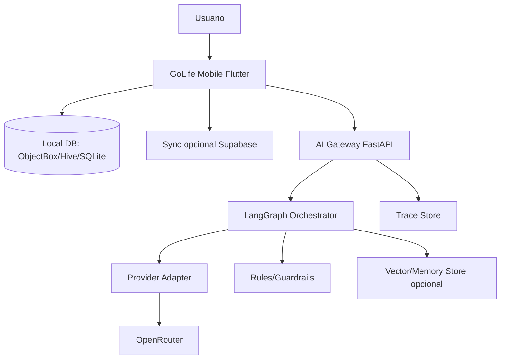

# SPEC — Especificación funcional y técnica

## Arquitectura general



## Decisión de shell móvil

Usar Flutter para el producto final por estos motivos:

- Habo es Flutter.
- Flow es Flutter.
- OpenWardrobe es Flutter.
- Taskly es Flutter.
- Flutter permite Android/iOS/web/desktop.
- Reutilizar conceptos de WeekToDo y Wanna por reimplementación/adaptadores.

## Estructura final recomendada

```text
apps/mobile_flutter/
  lib/
    app/
      app.dart
      router.dart
      theme/
    core/
      privacy/
      storage/
      sync/
      ai_client/
      lifegraph/
    domains/
      habits/
      tasks/
      week/
      finance/
      wardrobe/
      pantry/
      missions/
    features/
      dashboard/
      copilot/
      onboarding/
    shared/
      widgets/
      utils/
```

## AI Gateway

```text
services/ai_gateway/
  app/
    main.py
    settings.py
    schemas.py
    providers/
      base.py
      openrouter.py
    graphs/
      golife_graph.py
    guardrails/
      policies.py
    tools/
      task_tools.py
      finance_tools.py
      pantry_tools.py
      wardrobe_tools.py
    memory/
      store.py
    tests/
```

## UI principal

### Pantalla 1: Home / Life Dashboard

Bloques:

- misión del día;
- tareas críticas;
- gasto de hoy;
- comida a usar;
- outfit sugerido;
- progreso XP;
- botón “preguntar a GoLife”.

### Pantalla 2: LifeQuest

- misiones;
- XP;
- progreso;
- recuperación de hábitos;
- narrativa simple.

### Pantalla 3: WeekPilot

- semana;
- tareas;
- bloques;
- conflictos;
- botón “reordenar con IA”.

### Pantalla 4: MoneyMirror

- gastos;
- patrones;
- microfugas;
- presupuestos;
- reflexión semanal.

### Pantalla 5: FridgeZero

- despensa;
- compra;
- vencimientos;
- recetas rápidas;
- lista mínima.

### Pantalla 6: ClosetLess

- armario;
- outfits;
- intención de compra;
- “¿ya tengo algo parecido?”.

### Pantalla 7: AI Trace

Pantalla técnica opcional:

- recomendación;
- evidencias;
- modelo usado;
- incertidumbre;
- datos enviados.

## Flujos clave

### Flujo: misión diaria

1. Usuario abre app.
2. Mobile genera resumen local de eventos permitidos.
3. AI Gateway recibe `LifeEvent[]`.
4. LangGraph clasifica estado del día.
5. Genera 1–3 misiones.
6. Guardrails filtran recomendaciones.
7. Usuario acepta una.
8. Se crea `Mission`.
9. Resultado actualiza LifeGraph.

### Flujo: TaskDoctor

1. Usuario crea tarea: “trabajo universidad”.
2. TaskDoctor detecta que es vaga.
3. IA propone:
   - abrir documento;
   - escribir índice;
   - buscar 3 fuentes;
   - redactar 300 palabras.
4. Usuario acepta/edita.

### Flujo: FridgeZero + MoneyMirror

1. Usuario registra comida disponible.
2. Usuario registra gasto alto en comida fuera.
3. IA detecta conflicto.
4. Propone misión:
   - cocinar con ingredientes existentes;
   - no comprar extra;
   - registrar ahorro estimado.

### Flujo: ClosetLess

1. Usuario quiere comprar chaqueta.
2. App compara armario.
3. IA dice:
   - tienes 3 prendas similares;
   - esta compra no añade combinaciones nuevas;
   - alternativa: usar outfit X.
4. Usuario decide.

## Requisitos no funcionales

- Offline-first.
- Consentimiento por dominio.
- Exportación de datos.
- Sin tracking oculto.
- Proveedor IA reemplazable.
- Pruebas por dominio.
- Logs sin datos sensibles en claro.
- Cifrado local si se almacenan datos sensibles.
- Confirmación humana antes de acciones externas.

## Riesgos

| Riesgo | Mitigación |
|---|---|
| Mezcla de licencias GPL/MIT | auditoría legal y decisión de licencia antes de copiar código |
| Complejidad por unir 6 apps | crear producto nuevo y migrar por módulos |
| Datos sensibles | local-first + consentimiento por dominio |
| IA inventa patrones | evidencias obligatorias + incertidumbre |
| Coste de IA | summaries locales + caché + modelos baratos por defecto |
| App demasiado grande | MVP con tareas, hábitos, gastos, despensa manual |
