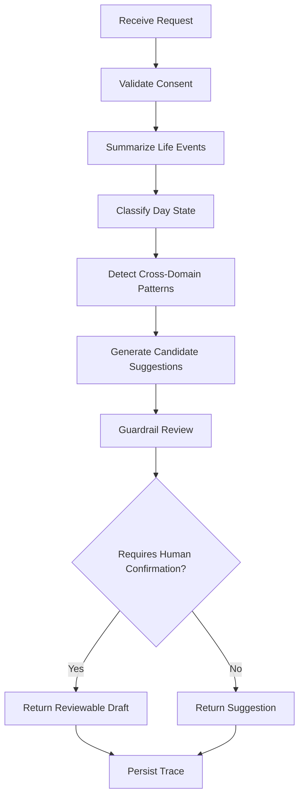

# Arquitectura IA — LangGraph, LangChain y OpenRouter

## Por qué no basta una llamada simple al LLM

GoLife necesita:

- combinar dominios;
- explicar evidencias;
- aplicar límites;
- guardar trazas;
- pedir confirmación;
- reintentar/fallback;
- mantener memoria;
- no exponer datos sin consentimiento.

## Componentes

### 1. AI Gateway

Servicio FastAPI.

Responsabilidades:

- recibir resúmenes de eventos;
- validar permisos;
- llamar al grafo IA;
- devolver sugerencias;
- guardar trazas;
- abstraer proveedor.

### 2. LangGraph

Grafo propuesto:



Nodos:

- `validate_consent`
- `summarize_events`
- `classify_state`
- `detect_patterns`
- `generate_suggestions`
- `guardrail_review`
- `rank_suggestions`
- `persist_trace`

### 3. LangChain

Uso recomendado:

- prompt templates;
- output parsers;
- retrieval opcional;
- tool abstractions;
- provider wrappers.

No usar LangChain como “magia”. Usarlo solo donde reduzca código o mejore trazabilidad.

### 4. OpenRouter

Proveedor inicial.

Requisito:

- la app nunca llama OpenRouter directo;
- solo AI Gateway lo llama;
- la clave queda en servidor;
- provider debe ser reemplazable.

## Provider interface

```python
class LLMProvider:
    async def complete_json(
        self,
        *,
        system_prompt: str,
        user_payload: dict,
        response_schema: dict,
        model: str | None = None,
        temperature: float = 0.2
    ) -> dict:
        ...
```

## Model routing

Variables:

```env
LLM_PROVIDER=openrouter
OPENROUTER_API_KEY=...
OPENROUTER_BASE_URL=https://openrouter.ai/api/v1
OPENROUTER_DEFAULT_MODEL=google/gemini-2.0-flash-001
OPENROUTER_FALLBACK_MODEL=meta-llama/llama-3.1-8b-instruct
```

Modelos exactos pueden cambiar. No fijar decisiones irreversibles.

## Guardrails

### Finance

Permitido:

- presupuesto;
- reflejo;
- alerta de gasto;
- educación general.

Prohibido:

- inversión personalizada;
- crédito/deuda como recomendación regulada;
- promesas de ahorro.

### Productivity

Permitido:

- dividir tareas;
- reordenar semana;
- sugerir descanso.

Prohibido:

- manipulación por culpa;
- castigos excesivos.

### Pantry

Permitido:

- recetas generales;
- vencimiento estimado;
- lista de compra.

Prohibido:

- afirmar seguridad alimentaria si no hay datos;
- recomendar consumir alimentos posiblemente peligrosos.

### Wardrobe

Permitido:

- outfits;
- duplicados;
- anti-consumo.

Prohibido:

- juicios corporales o estéticos dañinos.

## Memoria

Niveles:

1. `session_memory`: temporal.
2. `weekly_summary`: resumen semanal.
3. `user_preferences`: preferencias explícitas.
4. `blocked_memory`: datos que nunca se guardan.

Toda memoria persistente debe tener consentimiento.

## Output JSON obligatorio

La IA debe responder siempre como JSON validable. Nunca texto libre sin schema.
